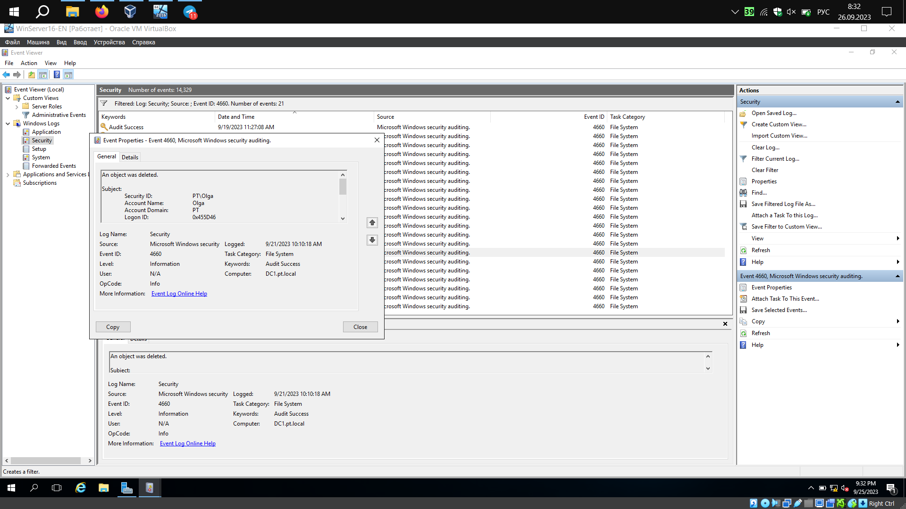

# Занятие 5

# Практическая работа №5.1 Обмен данными в домене.

1.1 Установим DFS на DC1

.png)

`DFS Namespases` - позволяет создавать пространство имен для фалов ресурсов

1.2 Зайдем в управление DFS и создадим новое пространство имен для сетевого пути:

.png)

1.3 Зададим имя целевого сервера и права доступа к сетевым ресурсам. У админов будет full-control

.png)

1.4 Выберем тип пространства имен. У нас будет `Domain-based namespace`

.png)

1.5 Готово

.png)

1.6 Проверяем доступность на RU-серваке

.png)

1.7 Создаем папку `share`. И `папки отделов внутри, + папку all_share`

.png)

1.8 Каждую эту папку нужно сделать сетевой. Идём в свойства папки (сделаем на примере buhg)

1.9 Вкладка sharing, пунк advanced sharing

1.10 Активируем галочку шаринга, а вконце имени сетевой папки ставим знак . После идём в permissions.

.png)

1.11 Выставляем права на чтение-запись для bugh-sec и удаляем группу everyone

.png)

1.12 Изменим права для security у папки HR. Добавим группу HR-sec и выдадим права на midify

.png)

.png)

1.13 **ВЫШЕОПИСАННЫЕ ОПЕРАЦИИ НУЖНО ПРОДЕЛАТЬ ДЛЯ ВСЕХ ПАПОК И ВСЕХ ОТДЕЛОВ**

1.14 Проверим доступ к сетевым ресурсам с PC1

.png)

Как видим все папки отображаются аналогично методичке.

# Практическая работа №5.2 Средства мониторинга Windows.

2.1 Добавим правило аудита для папки share

.png)

2.2 Отметим группу `Domain Users`

.png)

2.4 Выставим type= `all`, чтобы мониторить как успех, так и отказ. Нажмём кнопку show advanced permissions

.png)

Отметили оба пункта Delete

2.5 Правило создано для папки `share`, а так же всех её вложенных папок и файлов

Создайте в папке `all_share` папку `folder-for-delete` для тестирования генерации событий

.png)

Теперь удалим ее от имени `Olga`

.png)

2.6 Откроем журнал безопасности и отфильтруем события. Нас интересуют следующие:

4656 - проверка прав доступа к объекту

4659 - запрос файла удаления

4660 - аудит удаления объекта

4663 - над объектом была выполнена конкретная операция `(у нас удаление)`

2.7 После установки фильтра находим нужную группу событий: 

.png)

.png)

.png)

**upd [26.09] - добавил скрин события 4660, пропустил его при формировании первого отчета**

# Реализация отправки журналов

3.1 Включим сервис сборщика логов и подтвердим его автостарт `wecutil qc`

.png)

3.2 Настроим политику отправки журналов на logcollector. Зайдём в редактор групповой политики и создадим новую, `log_delivery`

.png)

3.9 Поиск не происходит среди ПК. Изменим это, добавив группу `компьютеры`

Теперь можем выполнить поиск по имени. Введем `PC1`

.png)

Удалим аутентифицированных пользаков и оставим только политику к пк `PC1`

.png)

Теперь нужно создать настройку Windows Remote Managment. Выбираем, двигаемся дальше.

.png)

На этом этапе нажмем на галочку возле `public` - она нам не понадобится

.png)

Видим успешно добавленный WinRM

.png)

Теперь нужно настроить путь до Log-Collector’a: `Server=http://dc1.pt.local:5985/wsman/SubscriptionManager/WEC,Refresh=60`

.png)

3.17 Для настройки политики нам требуется дескриптор безопасности журнала. Найдем его на `PC1` командой `wevtutil gl security`

.png)

3.18 Настроим доступ учеток до журнала `security` при помощи внесения параметра `O:BAG:SYD:(A;;0xf0005;;;SY)(A;;0x5;;;BA)(A;;0x1;;;S-1-5-32-573)`

.png)

3.20 И отдельно добавим учетную запись, которую в дальнейшем будем использовать для чтения журналов, в группу читателей журнала. Зайдём в политику локальных групп и добавим правило для локальной группы

.png)

Внесем `PT\Domain Admins`

.png)

3.24 Применяем на домен

.png)

3.25 Настроим прием логов на коллекторе. Пройдя в event viewer, зайдём в меню подписок и подтвердим автоматическое включение службы. Выбираем доменный компьютер, принимаем.

.png)

Ошибок нет!

.png)

3.33 Зайдём в меню Advanced, укажем для сбора УЗ администратора

.png)

3.35 Ошибок нет

3.36 Дадим доступ сетевой службе до чтения журнала безопасности, выполним команду на `PC1`

.png)

3.37 Спустя 20-25 минут начали появляться журналы

Вот так выглядит полноценный список внесенных нами изменений:

# Настройка сборщика логов при компьютерах-инициаторах

4.1 На сервере-коллекторе выполнить команду `winrm qc`, ответить согласием на оба последующих вопроса (включение службы WinRM и прослушивание порта TCP:5985 для входящих соединений от источников)

4.2 На сервере-коллекторе выполнить команду `wecutil qc`, согласиться на включение службы сборщика событий Windows.

4.3 На источниках событий следует включить службу WinRM **(реализовано политикой в пункте 3.4)** 

4.4 Создать подписку, где инициатором будут компьютеры

